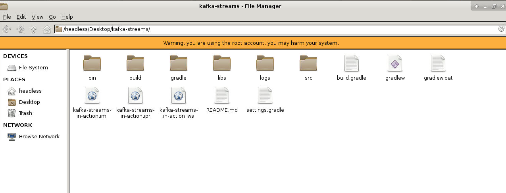
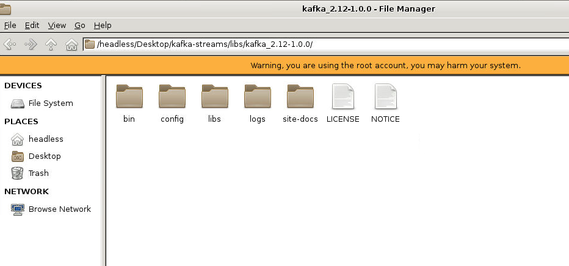

### Source Code for Kafka Streams

Welcome to the source code for Kafka Streams.  Here you'll find directions for running the example codes.

#### Requirements
This project assumes and requires the following

1. Java 8
2. Gradle

If you don't have gradle installed, that's ok, this project uses the gradle wrapper.  This means
the first time you run the ./gradlew or gradlew command gradle will be installed for you.

#### Clone Respository Dependencies

```
cd ~/Desktop

git clone https://github.com/fenago/kafka-streams.git
```




#### Included Dependencies

1. kafka_2.12-1.0.0.tgz


Kafka itself (version 2.12-1.0.0) is included as a convenience. 

All other dependencies are taken care of via gradle.
 
#### IDE setup
The gradle eclipse and intellij plugins are included in the build.gradle file.
 
1. To set up for intellij run `./gradlew idea` from the base directory of this repo.

```
cd ~/Desktop/kafka-streams

./gradlew idea
```

#### Open Project in IntellJ

Open IntelliJ and open `~/Desktop/kafka-streams` project.


#### Installing the included Kafka
Run tar xvzf  kafka_2.12-1.0.0.tgz some where on your computer.

```
cd ~/Desktop/kafka-streams/libs

tar xvzf kafka_2.12-1.0.0.tgz
```




#### Running Kafka
1. To start kafka go to <install dir>/kafka_2.12-1.0.0/bin
2. Run `./zookeeper-server-start.sh ../config/zookeeper.properties`
3. Run `./kafka-server-start.sh ../config/server.properties`


#### Running the Kafka Streams examples
 
All of the example programs can be run from the command line.  There are gradle
tasks for each of the examples we have so far.  The provided Kafka will need to be running before
you can start any of the examples.  Also there is a script in the bin directory (create-topics.sh) that creates all topics
required (I think I've added all topics, but may have missed one or two).  If you don't run the script that's fine, Kafka auto-creates topics by default.  For the purposes
of our examples that is fine.

All examples should print to the console by default.  Some may write out to topics and print to standard-out
but if you don't see anything in the console you should check the source code to make sure
I did'nt miss adding a print statement.

To run any of the example programs, I recommend running them through the set gradle tasks.  Remember if you are
windows use gradlew.bat instead  ./gradlew to run the program.  All the 
example programs are located in the build.gradle file.  For your convenience here are the commands to run kafka streams programs:

1. ./gradlew runYellingApp (Kafka Streams version of Hello World)
2. ./gradlew runZmartFirstAppChapter_3
3. ./gradlew runZmartAdvancedChapter_3
4. ./gradlew runAddStateAppChapter_4
5. ./gradlew runJoinsExampleAppChapter_4
6. ./gradlew runAggregationsChapter_5
7. ./gradlew runCountingWindowingChapter_5
8. ./gradlew runGlobalKtableChapter_5
9. ./gradlew runKStreamKTableChapter_5


#### Example Kafka Streams Program Output
When running the examples, the program will generate data to flow through Kafka and into the sample
streams program.  The data generation occurs in the background.  The Kafka Streams programs will run for 
approximately one minute each.  The sample programs write results to the console as well as topics.  While you
are free to use the ConsoleConsumer or your own Consumer, it's much easier to view the results flowing to the console.